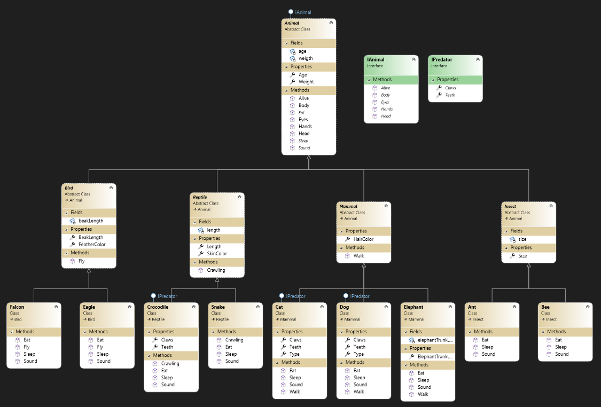

# Zoo

This program is used to manage a Zoo classes, using OOP conceptes and UML (class) diagram.

## Class Diagram (UML)


## OOP Has 4 Pillars

### 1) Inheritance

- Inheritance enables you to create new classes that reuse, extend, and modify the behavior defined in other classes.
- Inheritance is a mechanisim in which one object acquires all the props and behaviors of a parent object.
- Conceptually, a derived classes is a specialization of the base class.
- Inheritance represent the **IS-A** relationship.

*for example in c#*
```c#
class Animal{ } // class Animal
class Bird : Animal{ } // class Bird inherited class Animal
class Falcon : Bird{ } // class Falcon inherited class Bird
```

You can not inherite multiple classes at same time, because of the ambiguity, interfaces solved this problem.


### 2) Encapsulation
- In object-oriented programming, encapsulation refers to the bundling of data with the methods that operate on that data, or the estricting of direct access to some of an object's components.

*for example in c#*
```c#
class Animal{
    private int weight;

    public int Weight{
        get{
            return weigth;
        }
        set{
            if(value < 1){
                throw new Exception("Weight cannot be less than 0");
            }else{
                weight = value;
            }
        }
    }
}

```

### 3) Polymorphism
- Polymorphism is a mechanism to perform single action in different ways.
- Polymorphism is a Greek word that means "many-shaped" and it has two distinct aspects:
    1. Compile-time (Overloading).
    2. Run-time (Overriding).

### 4) Abstraction
- Two ways to achive abstraction:
    1. Abstract class (0 - 100)%.
    2. Interface (100%).
- The abstract keyword enables you to create classes and class members that are incomplete and must be implemented in a derived - class.
- It can have abstract and Non-abstract methods.
- It can not be instantiated, so it need to be extended.

## Interface 

You can not inherite multiple classes at same time, because of the ambiguity, interfaces solved this problem.

```c#
class A{ void Print(){ ... } } // class A has a method Print()
class B{ void Print(){ ... } } // class B has a method Print()

class C : A,B { } // class C inherites class A and B (Not Allowed)
```

Now, class C which Print() shuold inherit? Here is the ambiguity, 

### Interface
- Interfaces came to solve the multiple Inheritance.
- All methods are Abstract, Public by default.
- You cannot instantiate an object from an Interface, so it should be implemented.

```c#
interface A{ void Print(); } // interface A has a method Print()
interface B{ void Print(); } // interface B has a method Print()

// class C implements class A and B, 
// now the method Print() has one body
class C : A,B {
    void Print(){ ... }
}
```

In this program I used ```IAnimal``` and ```IPredator``` interfaces.

The ```IAnimal``` Confirms the animal senses, like eyes, head ...
The class ```Animal``` implement the ```IAnimal``` interface, 

The ```IPredator``` Confirms the animal senses to be a Predator, like Teeth, Clows...
The classes ```Crocodile```, ```Dog``` implement the ```IPredator``` interfaces, 

